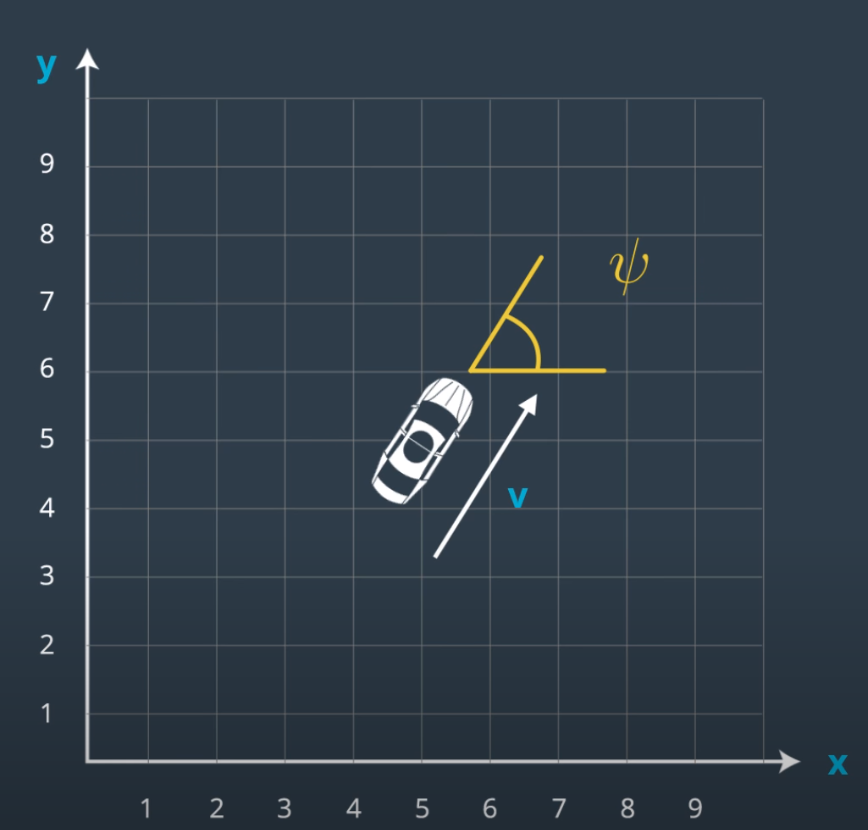
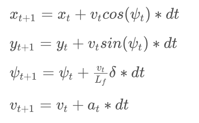

# Vehicle Dynamics

## Intro

- One approach to writing a good controller is to first model the vehicle's dynamics and constraints. It is important to understand how the vehicle works and this allows use to analyze and tune the controller more efficiently. A trade-off exists where more realistic models are more complex and challenging to work with. 

- An example of a vehicle model is the kinematic model. They are very simple to work and perform well. On the otherhand, the kinematic models ignore many elements like gravity and tire forces. Dynamic models captures more realistic forces.

--- 
## Vehicle Models

### 1. Kinematic Models

- Simplification of dynamic model that ignore forces, gravity and mass.

- This simplification reduces the accuracy of the models, but it also makes them more tractable.

- At low and moderate speeds, kinematic models often approximate the actual vehicle dynamics.

### 2. Dynamic Models

- Dynamic models aim to embody the actual vehicle dynamics as closely as possible.

- They might encompass tire forces, longitudinal and lateral forces, inertia, gravity, air resistance, drag, mass, and the geometry of the vehicle.

- Not all dynamic models are created equal! Some may consider more of these factors than others.

- Advanced dynamic models even take internal vehicle forces into account - for example, how responsive the chassis suspension is.

# State

- The simplest way to model a vehicle is to measure from a reference point the:

[ x-positon (x) , y-positon (y), heading (ψ), velocity (v) ]

- Now there is a need for equations to determine the next state (state at t+1) from our state vector at timestep, t, and our actuator values. Note that we’ve added a variable to our state called Lf. 

​
- Lf measures the distance between the front of the vehicle and its center of gravity. The larger the vehicle , the slower the turn rate.

- Below are the equation to model the Global Kinematic Model

- [x,y,ψ,v] is the state of the vehicle, Lf
​ is a physical characteristic of the vehicle, and [δ,a] are the actuators, or control inputs, to our system.

